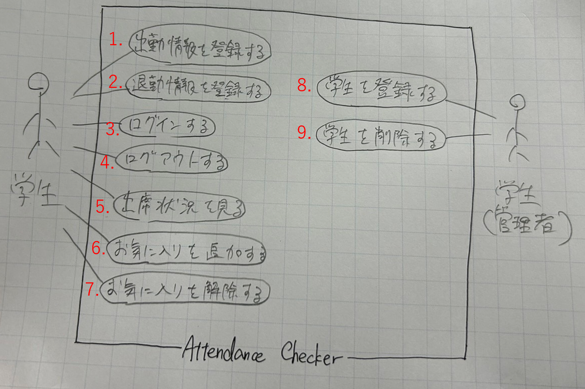

## 出席確認システム　ユースケースモデリング

出席確認システムのユースケースモデルを行う。

## 1.ユースケース図

## 2. ユースケース一覧
### 2.1 ユーザ用ユースケース
1. [出勤情報を登録する](./RegisterAttendInfo.md)
2. [退勤情報を登録する](./RegisterLeaveInfo.md)
3. [ログインする](./TaskHattori.md)
4. [ログアウトする](./TaskHattori.md)
5. [出席状況を確認する](./usecase_attend.md)
6. [お気に入り登録をする](./FavoritesResister.md)
7. [お気に入りを解除する](./FavoritesCanceller.md)

### 2.2 管理者用ユースケース
1. [学生を登録する](./usecase08.md)
2. [学生を削除する](./usecase09.md)
