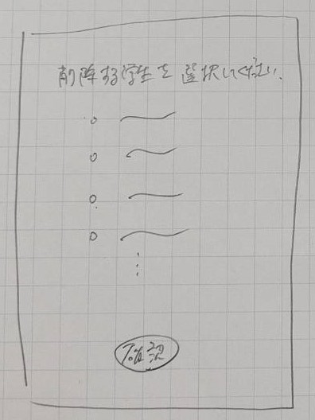
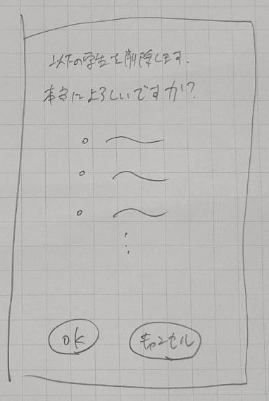

# ユースケース 9： 学生を削除する

## 概要
管理者が既存の学生をシステムから削除する．

## アクター
- 管理者

## 事前条件
- 管理者が学生管理画面を表示している．

## 事後条件
- システムから既存の学生が削除される．

## トリガ―
- 管理者が「学生削除」ボタンを押す．

## 基本フロー
1. 管理者が，「学生削除」ボタンを押す．
2. システムは，学生削除画面を表示する．
3. 管理者は，学生削除画面で削除したい学生を選択し，確認ボタンを押す．
4. システムは，確認画面を表示する．
5. 管理者は，OKボタンを押す．
6. システムは，選択された学生の学生情報を削除する．

## 代替フロー
### 代替フロー1
- 5.a.1  基本フロー5において，管理者がキャンセルボタンを押した場合，2に戻る．

## GUI紙芝居
### 学生削除画面

### 確認画面

